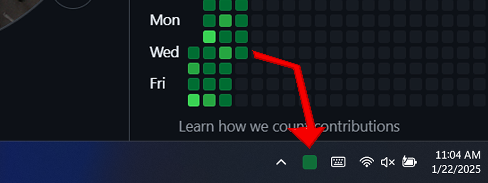

# Daily-Commit-Tracker

# What I learned...
Throughout creating this project I learned how to call API's in C++, properly connect libraries through the `tasks.json`, properly use relative paths, project file structures, use the windows tray. I am still learning to use Make to statically link the files and store them in the `.exe` file directly but that will be done in the private repo.

Overall what this project taught me most was how effective using C++ is for creating real deployable software. 

# **This Repository as Been Archived!**
I am planning on selling this software in the future. It wouldn't really be a good idea to have this code public while I work on it lol. This project started out as a way to learn C++ and has turned into a lot more.

# Purpose
This is a tray icon that appears green if the user has done a GitHub commit today. It appears gray if the user has not. You must give the application permissions through a GitHub token. The user must also install the necessary libraries and more. I will fix these problems in the next release!

# App Installation
### **Github Access Token**
If you want to count commits for private repositories use this method
1. Go to [Github Developer Settings](https://github.com/settings/tokens)
2. Click `Generate new token (classic)`
3. Name the token
4. Set the expiration to any time. 
 - Longer experiration: less hassle
 - Shorter expiration: more secure
5. Under select scopes check [X]`repo:status`
7. Generate Token
8. Place your token in the "TOKEN.env" file

# Binary Installation / Instructions
### **libcurl**
1. Download libcurl `curl-8.10.1`
 - [Site Link](https://curl.se/windows/)
 - [Download Link](https://curl.se/windows/dl-8.10.1_1/curl-8.10.1_1-win64-mingw.zip)
2. Extract zip file
3. Open the extracted folder and drag it into this folder
  - Note: It's inside the unzipped folder with the same name
4. Run `curl.exe` inside `bin\`
5. Add the bin folder to your system environment variables under path
 - `{Whatever path you need}\Daily-Commit-Tracker\bin\curl-8.10.1_1-win64-mingw\bin`
6. I added this functionality already but if you want to know where I got it:
  Make a `cacert.pem` file and place it in the `Daily-Commit-Tracker` folder
 - [Site Link](https://curl.se/docs/caextract.html)
 - [Download Link](https://curl.se/ca/cacert.pem)

Daily-Commit-Tracker
| lib
| | curl-8.10.1_1 (folder)
| | | bin
|README.md

*If you want to change directory make sure you update the environment variables and the .vscode/tasks.json*

#### **nlohmann**
1. Download `nlohmann\json.hpp`
 - [Site Link](https://github.com/nlohmann/json/releases)
 - [Download Link](https://github.com/nlohmann/json/releases/download/v3.11.3/json.hpp)
2. Place it in the nlohmann folder

#### **shell32.lib**
1. Add `"-lshell32",` to tasks.json

## Release Creation
I downloaded Inno from here [Site Link](https://jrsoftware.org/isdl.php)

## Other
### **Adding the application to startup**
1. `Win+R` Windows Key + R
2. input: `shell:startup`
3. Place a **LINK**/shortcut to the `main.exe` file in this folder
   - if it isn't a link/shortcut this will not work 
 - After this it *should* open on startup although I am not certain lol 
 - (I will try and make a way for the user to press a button and do this)
  - Example: `C:\Users\[YourUserName]\AppData\Roaming\Microsoft\Windows\Start Menu\Programs\Startup`

## Completed To-Do
1. [X] Create anything in the taskbar tray
2. [X] Implement taskbar changes to code
3. [X] Fix file structure
4. [X] Create method to type in or change information on first startup
5. [X] Add an icon for when no connection
6. [X] Change file paths to be based on the root folder to allow running the .exe to be consistent. 
7. [X] Make Private Repository to add this to my patreon

# Liscense: All Rights Reserved